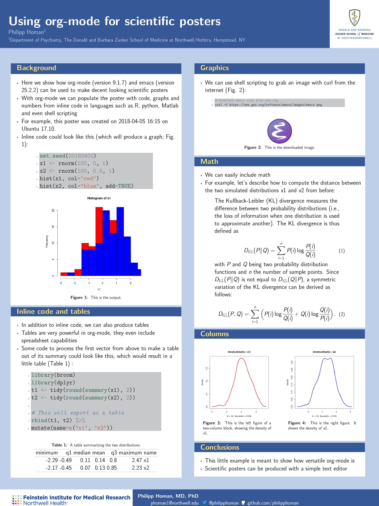

# Creating scientific posters with org-mode

# Author

Philipp Homan <phoman1 at northwell dot edu>

# Getting Started

This is a simple template to produce a scientific poster with emacs and
org-mode. It includes a Makefile so that the poster can be created from
the command line by running the 'make' command.

## Prerequisites

To create the poster from the command line, GNU emacs and texlive must
be installed together with some additional emacs and texlive
packages. Specifically, the following software and associated libraries
are required:

### texlive

-   xetex

-   latexmk

### emacs

-   org-mode

-   ess

-   org-ref

### R

-   pacman

-   cowplot

-   ggplot2

# Installing

Download the repository and run tar xvfz on the tarball.

# Creating the poster

Change to the org-mode-poster directory and run 'make poster'.

# Built With

Ubuntu 17.10 on emacs
25.2.2 and org-mode
9.1.7.

